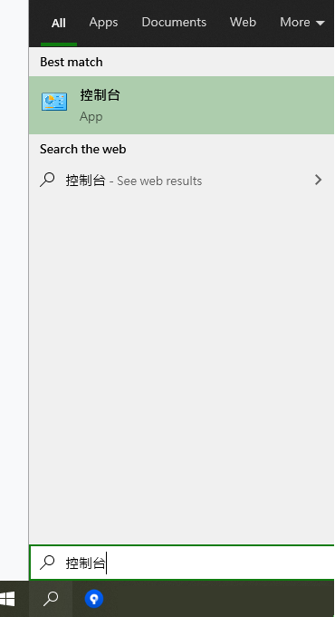
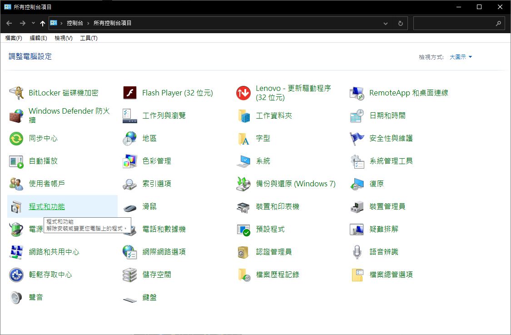
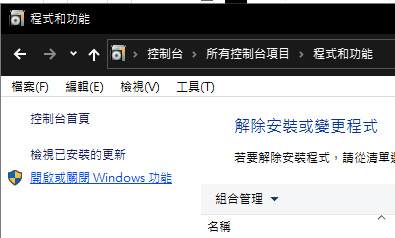
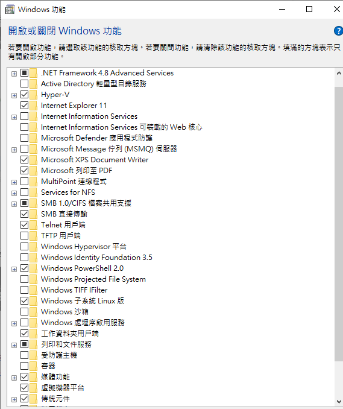
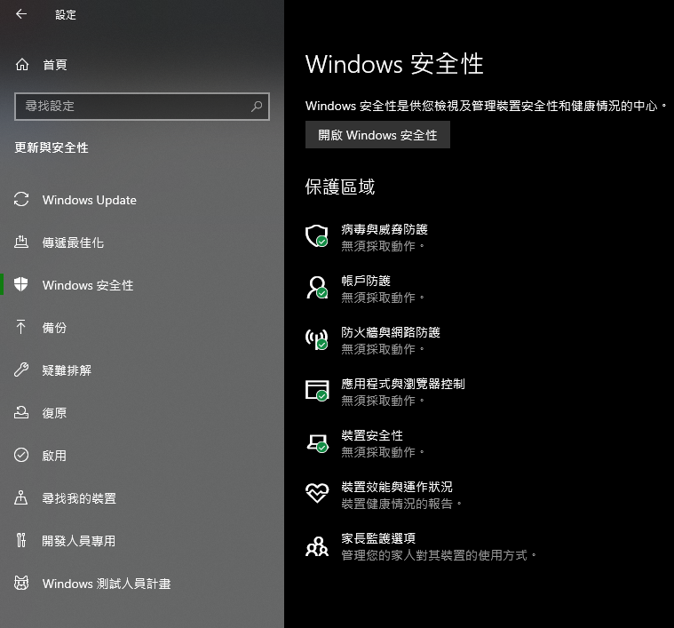
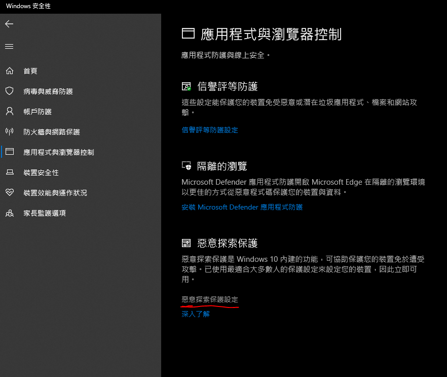
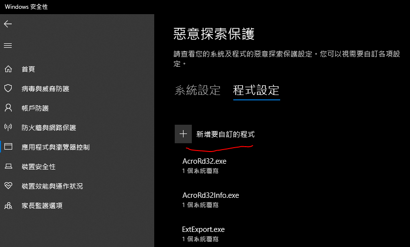
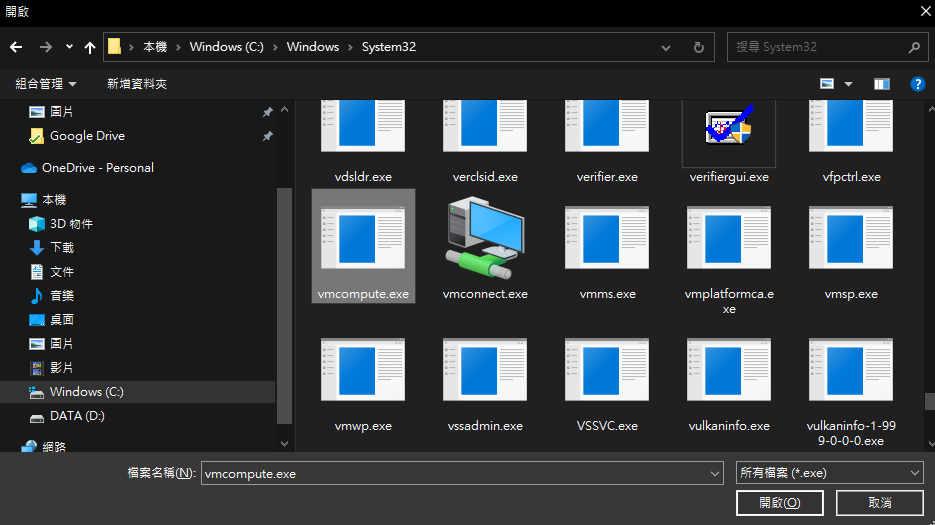
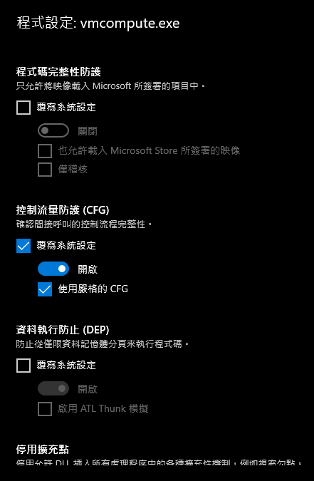
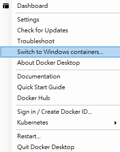

docker安裝說明
===

## 注意事項

> 在windows底下安裝docker必須搭配hyper-v服務，且該服務和virtualbox會相衝，開始安裝步驟前請先移除virtualbox相關元件。

## 安裝步驟

###  設定bios

> docker需要用到intel虛擬化技術或AMD SVM，請先重開機並按下(F1 -
> thinkpad, F2 -
> dell)進入bios開啟相關設定，如果你之前跑過virtualbox可以正常運作，那基本上就是已經開好了

### 安裝hyper-v
- 開啟控制台

> 

- 程式和功能

- 開啟或關閉windows功能

> 

- 勾選hyper-v與虛擬機器平台

> 

**安裝後請務必重開機**

### 將hyper-v服務加入惡意探索保護(windows 10 enterprise版)

- 開啟windows 安全性

- 點選應用程式與瀏覽器控制

- 點一下惡意探索保護設定

- 再點一下新增要自訂的程式，指到C:\\WINDOWS\\System32\\vmcompute.exe

- 設定完畢之後再點一下vmcompute.exe可以進行編輯，請依照圖片設定

**完成後請務必重開機**

### 下載Docker Desktop Community
----------------------------

> 請下載 2.3.0.5版
>
> https://desktop.docker.com/win/stable/48029/Docker%20Desktop%20Installer.exe

### 安裝docker desktop

> 將下載的檔案點兩下進行安裝，安裝期間會詢問要使用windows
> container還是linux container，請選擇linux container
>
**安裝後請務必重開機**

## 測試docker

> 開啟cmd，並輸入docker run hello-world

應該會看到歡迎訊息

## 疑難排除

### hyper-v開不起來

> 通常是防毒軟體的的問題，請再嘗試步驟2.3並重新開機，或是到windows系統管理工具的服務試著重啟Hyper-V
> 主機運算服務

### docker無法執行

> 請用系統管理員開啟powershell並執行
>
> bcdedit /set hypervisorlaunchtype auto
>
> 再重開機

### 無法執行hello-world

> 有可能是你的container選到windows了，請改回linux container

- 在右下角的docker圖示上按右鍵應該要看到這個畫面(這樣就對了，不要動!)

